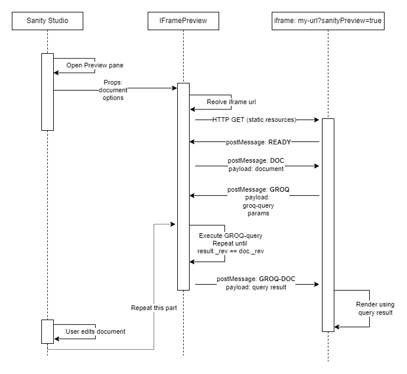

# Sanity Plugin: IFrame Preview - Alpha release

THIS IS A PROOF OF CONCEPT, CONSIDER IT WORK IN PROGRESS.

Sanity Iframe Preview component.

## At-a-glance

* Use IFramePreview component in studio structure view.
    * Configure with render-app preview-url
* Use [sanity-iframe-api](../sanity-iframe-api) or [sanity-iframe-api-react](../sanity-iframe-api-react) in the render-app.
    * Configure with groq-query (or just use document directly from Sanity Studio as is)
* Enjoy live-updated preview in Studio, with queries executed by the Studio on behalf of the render app.

Implements an iframe.postMessage protocol  that allows the target iframe to specify
a GROQ-query for the studio to execute.
The result of the query will be sent to the iframe whenever the query
revision matches the studio revision.

## TODOS
* Generic type param for document
* Tests
* Better error messages & error handling 
* jsdocs
* Better docs

## Install
Install as a dependency in your Sanity Studio:

`npm install @snorreeb/sanity-plugin-iframe-preview`

## Usage
Use in your structure code:
```ts
import { IFramePreview } from '@snorreeb/sanity-plugin-iframe-preview'

S.view
  .component(IFramePreview)
  .options({
      url: (doc: SanityDocument) => 'iframe-url', // (doc) => (string | Promise<string>)
      mapDocument: (doc: SanityDocument) => ({ _id: doc._id }),
      desktopMinWidth: 900,
   })   
  .icon(EyeIcon)
  .id("preview")
  .title("Preview")
```

Read [IFramePreviewBasicProps](src/components/IFramePreview.tsx) jsdocs for config details.

### Define preview component from schema
To enable iframe preview directly in schema definition, you can do something along the lines of this:
```ts
// someSchema.tsx
export const someSchema = {
    type: 'document',
    title: 'Some doc',
    previewComponent: IFramePreview,
    fields: [/** omitted */]
}

// given sanity.json with structure implemented like so
{
  "name": "part:@sanity/desk-tool/structure",
  "path": "./structure.ts"
}

// structure.ts
export function editAndPreviewViews<T>(previewComponent: IPreviewComponent<T>) {
  return [
    S.view.form().title("Edit").icon(EditIcon),
    S.view
      .component(previewComponent)
      .icon(EyeIcon)
      .id("preview")
      .title("Preview"),
  ];
}

// https://www.sanity.io/docs/structure-builder-reference#97e44ce262c9
export const getDefaultDocumentNode = ({ schemaType }: any) => {
  const matchingTypes = S.documentTypeListItems()
    .filter((listItem: any) => listItem.spec.schemaType.name === schemaType)
    .map((listItem: any) => {
      const previewComponent = listItem.spec.schemaType.previewComponent;
      if (previewComponent) {
        return S.document().views(editAndPreviewViews(previewComponent));
      }
      return S.document();
    });
  return matchingTypes.length ? matchingTypes[0] : S.document();
};

export default () => S.list().items(/* your structure */)
```

*Caveat*: uses access to protected `listItem.spec` feield; this might break in future Sanity releases.

## Sequence diagram for dataflow



## Types
`sanipack` seems to be kinda particular about not building types. 
Therefore, type are build separately and placed in `/lib/types`.

## Develop

### Build
`npm run build`

### Test
```bash
cd /path/to/my-studio
npm link sanity-plugin-iframe-preview-alpha
```

