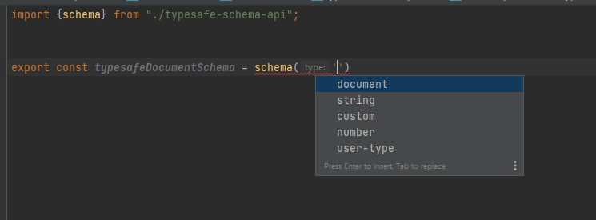
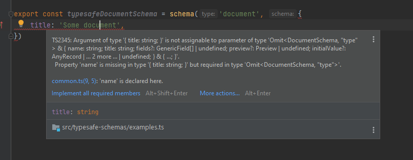

# Sanity Typesafe Schemas

Utility functions to ease Sanity schema development:

* `schema(typeName, schemaDefinition)`: used to define schemas that is consumed by `createSchema`.
* `field(typeName, fieldDefinition)`: used to define fields for `document`, `object`, `file` and `image` schemas.
* `arrayOf(typeName, arrayMemberDefinition)`: used to define of-entries in `array` schemas.
* `typed<T>(anything)`: passthrough function to provide inline types in json objects.

## API design goals

- Typesafe Sanity schemas (and with that, autocompletion)
- Feature discovery of built-in Sanity features (types, options, validations)
- Breadcrumb-trails to relevant Sanity docs
- Feature discovery & documentation of extension types & features (custom input-resolver options, reusable schema-types etc.)
- Decrease time from idea to finished schema for developers, by embracing the above.
- Opt-in. Ie, this can be sprinkled into an existing codebase to gradually add type safety to schemas.
- Minimal runtime footprint. Should not mess with the schema provided by the developer.

### Type discovery



### Feature discovery


### Typesafety



### Documentation


# Installation

`npm i sanity-typesafe-schemas-alpha`

# Usage

```ts
import { field, schema } from "sanity-typesafe-schemas-alpha";

export const typesafeDocumentSchema = schema("document", {
    name: "some-doc",
    title: "Some document",
    fields: [
        field("string", {
            name: "someField",
            title: "Some title",
            initialValue: "a",
            options: {
                list: [
                    { value: "a", title: "A" },
                    { value: "b", title: "B" },
                ],
                layout: "radio",
            },
        }),
    ],
});

//@ts-expect-error schema is not correctly defined
const withErrorSchema = schema("string", {});
```

See [code examples](src/examples).

## Extending Sanity schemas
Use [TypeScript declaration merging](https://www.typescriptlang.org/docs/handbook/declaration-merging.html) 
to extend the types under `sanity-typesafe-schemas-alpha/schemas`:

```ts
// document-extension.ts
import "sanity-typesafe-schemas-alpha";
declare module "sanity-typesafe-schemas-alpha" {
    interface DocumentSchema {
        options?: {
            custom?: boolean;
        };
    }
}

// somewhere using typesafe helpers
export const typesafeDocumentSchema = schema("document", {
    /* omitted */
   options: {
       custom: true // custom is now a valid option for all document shemas
   } 
});
```

## Adding reusable schema types
Define your schema type, and use [TypeScript declaration merging](https://www.typescriptlang.org/docs/handbook/declaration-merging.html)
to extend `SchemaDirectory` in `sanity-typesafe-schemas-alpha/schema-directory`:

```ts
// special-string-schema.ts
import { StringSchema } from "sanity-typesafe-schemas-alpha";
export type SpecialStringSchema = Omit<StringSchema, "type"> & {
    type: "special-string";
    options: {
        special: string;
    };
};

// schema-directory-extension.ts
import "sanity-typesafe-schemas-alpha";
declare module "sanity-typesafe-schemas-alpha" {
  interface SchemaDirectory {
    "special-string": SpecialStringSchema;
  }
}

// somewhere using typesafe helpers
export const specialStringSchema = schema(
    "special-string", // special-string is now a valid, autocompletable type
    {/* omitted */}
);
```

## Escape hatches

### Defining ad-hoc types without extending anything
The `'custom'` string  is a general escape hatch that still provides some safety.
Use alongside the `typed` generic helper function, to define inline types.

```ts
import { schema, typed } from "sanity-typesafe-schemas-alpha";

export const stringSchemaUsedByNameSomewhereElse = schema("custom", {
    type: "string", // when using 'custom', type must be provided here
    name: "this-name-is-used-in-another-schema",
    title: "Custom stringtype for whatever reason",
    inputComponent: () => "Render me softly",
    options: typed<{customOption: boolean}>({
        customOption: true
    })
});
```

### Force `undefined` title
Title is optional in Sanity Studio, but will result in console.log warnings if omitted.
Therefore, it is required by the schema-helpers.

To set an undefined title anyway, hack-cast it:

```ts
const mySchema = schema('object', {
    title: undefined as unknown as string    
});
```

## Runtime footprint

Compiled to javascript, the helper functions look like this:

```js
function schema(type, schema) {
    return {
        type,
        ...schema
    }
}

function field(type, schema) {
    return {
        type,
        ...schema
    }
}

function arrayOf(type, schema) {
    return {
        type,
        ...schema
    }
}

function typed(anything) {
    return anything
}
```

Ie, they are basically an identity functions with no overhead.

## FAQ

### Why are Sanity schema types partially reimplemented?
Types in `@sanity/types` are the _compiled_ definition of schemas, obtained
after passing schema-definitions to `createSchema`.

The schema-definition types are subtly different and may or may not contain internal fields.
Terefore, types are reimplemented to resemble the [Sanity schema documentation](https://www.sanity.io/docs/schema-types) 
to avoid confusion and/or add jsdocs.

### But the types are wrong! 
(╯°□°)╯︵ ┻━┻

We will get there eventually! 🤞

Until then: use the escape hatches & `typed` helper where necessary. 

┬─┬ノ(º_ºノ)
